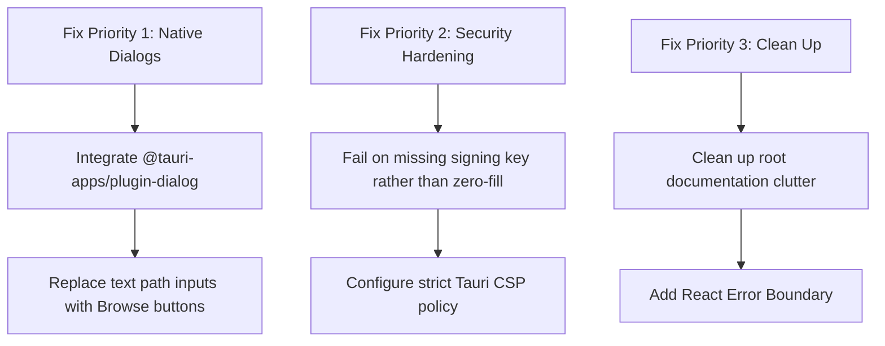

# Purgent — Project Verification Report

> **Generated:** September 2026  
> **Status:** Comprehensive Audit Completed  
> **Architecture:** Rust Core (`purgent-core`) + Tauri v2 Desktop Bridge + React Frontend (Vite)

---

## 📌 Executive Summary

Purgent is an enterprise forensic data sanitization and recovery desktop application.
- **Rust Backend (`purgent-core`)**: **~95% Complete & Production-Grade**. Contains 15 specialized modules with deep hardware-level implementations (IOCTLs, ATA commands, signature carving, HMAC tamper-proofing).
- **Tauri Bridge (`src-tauri`)**: **~95% Functional**. 17 commands fully wired with bi-directional event emission.
- **Frontend (`src`)**: **~70–75% Functional**. Solid dual-mode UI (Landing Showcase & Tactical Console), but contains UX gaps (manual path entry instead of native dialogs), placeholders in marketing views, and security configurations needing hardening.

---

## 🟢 1. Working Features (Backend — Rust)

All core modules are backed by authentic low-level routines, automated tests (`crates/purgent-core/tests/corpus.rs`), and demo harnesses:

| # | Feature / Module | Implementation Location | Verification Details |
|---|------------------|-------------------------|----------------------|
| 1 | **Drive Enumeration** | `crates/purgent-core/src/modules/storage/` (`windows.rs`, `linux.rs`) | Native IOCTLs on Windows (`IOCTL_DISK_GET_DRIVE_LAYOUT_EX`) and `/sys/block` inspection on Linux. |
| 2 | **HPA / DCO Detection & Removal** | `storage/hpa_dco.rs` (~32 KB) | Hardware task-file ATA command sets to detect hidden disk areas and unfreeze configurations. |
| 3 | **ATA Secure Erase & NVMe Sanitize** | `storage/secure_erase.rs` (~20 KB) | Passthrough commands for hardware-level controller firmware sanitization. |
| 4 | **Block Overwrite Wipe Engine** | `drive_eraser.rs` (~36 KB) | Multi-pass algorithms (NIST 800-88 Rev 1, DoD 5220.22-M, IEEE 2883) with verification readbacks. |
| 5 | **File Eraser & Slack Scrubber** | `file_eraser.rs` (~23 KB) | Sector-aligned overwrite of individual files and filesystem slack space scrubbing. |
| 6 | **Trace Scrubber** | `trace_scrubber.rs` (~12 KB) | Clean-up of residual temp artifacts and lingering pointers post-erasure. |
| 7 | **File Carving & Recovery** | `recovery.rs` (~49 KB) | Deep file carving analyzing binary signatures (headers/footers) and defragmentation heuristics. |
| 8 | **File Classification** | `classification.rs` (~3.7 KB) | Auto-classification of recovered artifacts by MIME type, extensions, and entropy. |
| 9 | **Signed Forensic Reporting** | `reporting.rs` (~27 KB) | Tamper-evident reports exported in JSON, XML, and PDF formats with HMAC-SHA256 digests. |
| 10 | **Report Verification** | `reporting.rs` (`verify_report`) | Independent offline cryptographic verification of report integrity. |
| 11 | **Operator Cryptographic Identity** | `signing.rs` (~2.9 KB) | Generation and management of local operator keyrings and fingerprint stamps. |
| 12 | **Local Persistence Engine** | `persistence.rs` (~18 KB) | SQLite database layer tracking historical operations, audits, cases, and certificates. |
| 13 | **Cloud Synchronization** | `sync.rs` (~13 KB) | Opt-in metadata replication layer integrating with Supabase. |
| 14 | **Worker Orchestration** | `operations.rs` (~13 KB) | Multi-threaded background job runner with live chunk-progress polling and cancellation hooks. |
| 15 | **Sanitization Standards Mapping** | `config.rs` (~8.8 KB) | Strict enum validation mapping user selections to regulatory standards. |

---

## 🟢 2. Working Features (Tauri IPC Bridge)

17 commands exposed in [`src-tauri/src/lib.rs`](file:///c:/Users/Preet/OneDrive/Desktop/Purgent/src-tauri/src/lib.rs) are tested and wired:

```
├── Health & Operator:     hello, get_identity, set_operator
├── Hardware & Standards:  list_devices, get_wipe_standards, get_erase_standards
├── Erasure Operations:    wipe_image, wipe_device, erase_path
├── Forensic Carving:      carve_source
├── Evidence & Reports:    list_reports, read_report, open_report_pdf, export_report_xml, open_report_xml
└── Cloud Management:      get_sync_status, set_sync_enabled, sync_now
```

- **Event Streams:** Emits `progress`, `operation-complete`, `operation-error`, and `sync-state` asynchronously to the webview.

---

## 🟢 3. Working Features (Frontend)

- **Landing Page Mode:** High-contrast aesthetic with custom dark theme, constellation particle background (`constellation-grid.tsx`), and responsive layout.
- **Console Mode:** Operational interface featuring:
  - Device list & physical media status table.
  - Dedicated tabs: Image/Device Wipe, File Shredding, File Carving, Compliance Reports.
  - Live progress monitoring with animated metrics and bytes-processed indicators.
  - Interactive report previewer displaying cryptographic signatures and raw JSON.
  - Built-in browser-fallback mock engine allowing frontend previewing outside Tauri runtime.

---

## ❌ 4. Non-Working, Incomplete, or Fake Features

### 🔴 High Priority / Usability & Security Deficits

1. **Missing Native File / Folder Picker Dialog:**
   - **Status:** Non-functional.
   - **Details:** The console prompts users to manually type absolute filesystem paths (e.g. `C:\cases\disk.img`). Although `@tauri-apps/plugin-dialog` is installed in `package.json`, it is not initialized in `src-tauri` or imported in React.
2. **Hardcoded Zero-Key Fallback:**
   - **Status:** Security Flaw (`src-tauri/src/lib.rs`).
   - **Details:** When the operator key derivation fails, the signing backend defaults to a static 32-byte zero key (`vec![0u8; 32]`). This breaks the integrity of forensic evidence certificates.
3. **Disabled Content Security Policy (CSP):**
   - **Status:** Vulnerability (`src-tauri/tauri.conf.json`).
   - **Details:** `"csp": null` is configured in Tauri, disabling webview XSS protections.
4. **Placeholder Testimonials:**
   - **Status:** Non-authentic Content (`src/components/ui/testimonials-faq.tsx`).
   - **Details:** Client quotes explicitly state: *"Role-based scenario"*, *"Illustrative use case — replace with verified results"*.
5. **Simulated Pricing & Commerce:**
   - **Status:** Cosmetic Only (`src/components/ui/pricing.tsx`).
   - **Details:** Displays commercial tiers ($74–$499/mo), but tier buttons redirect to a simple `mailto:sales@purgent.dev`. No checkout, licensing, or payment gateway exists.

---

### 🟡 Medium Priority / Incomplete & Dead Code

6. **Hardcoded Device Health Indicator:**
   - In `App.tsx`, all detected physical drives display a static health status of `"good"`, without actual SMART attribute validation.
7. **Unused `cn()` Utility:**
   - `src/lib/utils.ts` implements standard Tailwind class merging (`clsx` + `twMerge`), but is not referenced across components.
8. **No React Router / URL State:**
   - State transition between Landing and Console is handled via single-state toggles; deep-linking or browser history back/forward is unsupported.
9. **No React Error Boundary:**
   - An unhandled error in asynchronous event parsing or rendering drops the entire desktop view to a blank screen.
10. **Unimplemented Roadmap Items in Pricing:**
    - Enterprise features like *Custom Signing Keys*, *Multi-operator Roles*, and *HSM / PKCS#11 Integration* are presented in pricing cards despite being unwritten.
11. **Directory Clutter:**
    - Redundant assets like `logo.jpg.png` (132 KB) in root and versioned documentation artifacts (`AGENTS (4).md`, `DECISIONS (4).md`, `RULES (2).md`).

---

## 📋 Recommended Action Plan



1. **Integrate Native File Dialogs:** Register `tauri-plugin-dialog` in `src-tauri/Cargo.toml` & permissions, and add "Browse..." buttons next to path inputs.
2. **Remove Fallback to Zero Keys:** Return a explicit `Result::Err` if the operator identity key cannot be read or initialized.
3. **Enforce Tauri CSP:** Replace `null` with a strict local script policy in `tauri.conf.json`.
4. **Purge Root Clutter:** Remove stale files (`logo.jpg.png`) and standardize repository documentation names.
